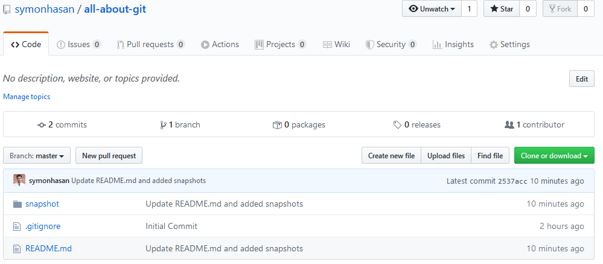

# All About Git

## Getting Started

Git is a free and open source distributed version control system designed to handle everything from small to very large projects with speed and efficiency. 

### Git Installation

Git can be simply installed from [Git-Scm](https://git-scm.com/downloads) for any operating system as it is available for Windows , Mac & Linux. Installation process is very simple. 

### Git Version Check

After sucessfully installing Git to your machine you can now check version by typing the following command in your Terminal or Git Bash
```
git --version
```
You may now see your installed Git version.

<p align="center"><em>Fig 1 - outcome of git --version command</em></p>

### Git Global Config

Now once you have sucessfully installed git now you need to set up some global configuration variable. Now these variables are important because if you working with other developers then they need to know who is making which changes and many other things. Now there are two important variable. One is `user.name` and another one is `user.email`. Of course there are lot more than these two but as we are getting started as beginner these two are enough for us.

- To set your username
```
git config --global user.name "<your name>" 
```
- To set your email
```
git config --global user.email "<your email>" 
```
- To list all your configuration
```
git config --list
```

** Snapshots are given below **


<p align="center"><em>Fig 2 - setting config variable</em></p>

<p align="center"><em>Fig 3 - outcome of git config --list command</em></p>

### Need Help?

If you need help regading any keyword you can try any of these two command
```
git help <keyword>
```
<p align="center">or</p>

```
git <keyword> --help
```

** Snapshots **

<p align="center"><em>Fig 4 - fetching help for config keyword</em></p>


<p align="center"><em>Fig 5 - outcome of git config --help command</em></p>

## Setting Up Local Repository

### Initialize

Let's say we have a project or we have a directory for project which we want to track with git in our local machine. To do so first we need to go to that project directory. In my case my project folder is currently empty as you can see in Fig .


<p align="center"><em>Fig - empty project folder</em></p>

Now to track this folder with git in our git bash we need to type the following command 
```
git init
```
This command will create a .git folder in your current working directory which stores all information about your project.


<p align="center"><em>Fig - initializing git</em></p>

To stop tracking your project with git just remove the .git folder from project directory. Your project will no longer be tracked with git. This will also remove all branches and commit you changed in your project if the project do not exist in remote repository.


<p align="center"><em>Fig - removing .git folder</em></p>

[ Optional ] If you need to initialize your local repository with README or gitignore file you can do this with following command.
```
touch README.md
touch .gitignore
```


<p align="center"><em>Fig - adding README and gitignore file to project folder</em></p>

### Checking Git Status

Before dive deeper into things there are basically three area. The first area is our working directory where we make changes to our files , projects etc. The second area is called staging area where we organize our files which we want to commit. And the last area is .git directory or repository where all the comiited changes are saved.

Now this all status can be checked using the following command in our git bash

```
git status
```

Now in our project if we now run this command we will see this 


<p align="center"><em>Fig - current status of local repo</em></p>

### Add files to staging area

Now this red color file are untracked file or the file we have made changes in our working directory. To add this file to staging area we need to type the following command 
```
git add -A
```
This command will add all the current untracked files in staging area. In Fig the file colored in green is currently in staging area and ready to be commited. 


<p align="center"><em>Fig - add all files to satge area</em></p>

To remove all file from staging area we can simply type 

```
git reset
```

This will remove all file from from staging area.

<p align="center"><em>Fig - remove all files from stage area</em></p>

To add a sepcific file we can type 
```
git add <filename>
```

<p align="center"><em>Fig - add specific file to stage area</em></p> 

To remove a specific file from stage area 
```
git reset <filename>
```

<p align="center"><em>Fig - git reset specific file</em></p>

Now for our project let's add all file to stage area.


<p align="center"><em>Fig - all files to stage area</em></p>

### Commit Changes

To commit changes that we have made in our project first we have to add all our files that we want to commit in staging area with `git add` command. You can see the new changes you have made in your files using 
```
git diff
``` 
After adding files in staging area now we can make changes to our repository by typing the following command in our git bash.
```
git commit -m "your massage"
```


<p align="center"><em>Fig - commit changes</em></p>

We can also see all our commits using the following command. It will list all our commits we made in our repository till now.
```
git log
```


<p align="center"><em>Fig - git log</em></p>

## Add Local Repository To Remote Repository

- Browse [Github](https://github.com) to create a new repository.

- Give your repository a name. Do not initialize the new repository with README, license, or gitignore files. You can add these files after your project has been pushed to GitHub if not exist. In our case we already created both README and gitignore file.  

- After creating new repository you may see a page with a remote repository url. In my case the url is shown in Fig . Copy this url


<p align="center"><em>Fig - remote url of new repository</em></p>

- Open Git Bash

- Change the current working directory to your project directory or local repository

- Now run this following command to your git bash.
```
git remote add origin < remote repository URL >
git remote -v
git push origin master
```

<p align="center"><em>Fig - adding local repo to remote repo</em></p>

- Refresh your github repository page and you will see all your files and commits you made in your local repository is now available in your remote repository. 


<p align="center"><em>Fig - github page after adding local repo</em></p>

## Clone Remote Repository

To clone a remote repository first you need to go to the directory where you may want to clone your repository. After that just type the following command in your git bash.

```
git clone <url of your remote repository>
```
To list the information about the repository you have cloned you can try
```
git remote -v
```
To list out all branches your cloned repository have you can try
```
git branch -a
```

## Push Changes

To push changes we made in our local repository to remote repository we need to ,

- Add your changed files to staging area
- Commit our changes


<p align="center"><em>Fig - commit change</em></p>

- Pull the changes other developers have made so far. Now this is important when two or more developer is working on a project so that before making any changes to remote repository from your side you are updated with what changes other developers have made till now. Pulling the changes can be done with the follwing command
```
git pull origin master
```


<p align="center"><em>Fig - pull changes to master branch</em></p>

- Now push your changes using following command. Pushing is important so that other developer may fetch what changes are made from your side.
```
git push origin master
```


<p align="center"><em>Fig - push changes in master branch</em></p>
Here `origin` is your repository and `master` is the branch where you are pushing the changes. Though it's not best practice to direcly push changes to master branch.

