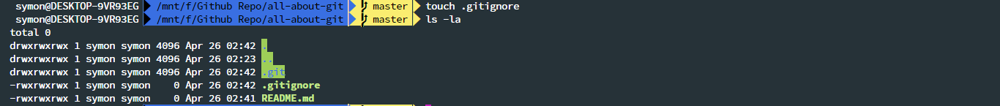

<p align="center">
  
</p>

<p align="center">
    <h2 align="center">Table Of Content</h2>
</p>

-   [Getting Started](#getting-started)
    - [Git Installation](#git-installation)
    - [Git Version Check](#git-version-check)
    - [Git Global Config](#git-global-config)
        

## Getting Started

Git is a free and open source distributed version control system designed to handle everything from small to very large projects with speed and efficiency. 

### Git Installation

Git can be simply installed from [Git-Scm](https://git-scm.com/downloads) for any operating system as it is available for Windows , Mac & Linux. Installation process is very simple. 

### Git Version Check

After sucessfully installing Git to your machine you can now check version by typing the following command in your Terminal or Git Bash
```bash
$   git --version
```
You may now see your installed Git version.

<p align="center"><em>Fig - git --version</em></p>

### Git Global Config

Once you have sucessfully installed git now you need to set up some global configuration variable. Now these variables are important because if you are working with other developers then they need to know who is making which changes and many other things. Now there are two important variable. One is `user.name` and another one is `user.email`. Of course there are lot more than these two but as we are getting started as beginner these two are enough for us.

- To set your username
```bash
$   git config --global user.name "<your name>" 
```
- To set your email
```bash
$   git config --global user.email "<your email>" 
```
- To list all your configuration
```bash
$   git config --list
```

Snapshots are given below


<p align="center"><em>Fig - setting config variable</em></p>


<p align="center"><em>Fig - git config --list</em></p>

### Need Help?

If you need help regading any keyword you can try any of these two command
```bash
$   git help <keyword>
```
<p align="center">or</p>

```bash
$   git <keyword> --help
```

 Snapshots 


<p align="center"><em>Fig - git config --help</em></p>

## Setting Up Local Repository

### Initialize

Let's say we have a project or we have a directory for project which we want to track with git in our local machine. To do so first we need to go to that project directory. In my case my project folder is currently empty as you can see in Fig .


<p align="center"><em>Fig - empty project folder</em></p>

Now to track this folder with git in our git bash we need to type the following command 
```bash
$   git init
```
This command will create a .git folder in our current working directory which stores all information about our project.


<p align="center"><em>Fig - initializing git</em></p>

To stop tracking our project with git we need to remove the .git folder from project directory. Our project will no longer be tracked with git. This will also remove all branches and commit we have made in our project if the project do not exist in remote repository.


<p align="center"><em>Fig - removing .git folder</em></p>

[ Optional ] If we need to initialize our local repository with README or gitignore file we can do this with following command.
```bash
$   touch README.md
$   touch .gitignore
```


<p align="center"><em>Fig - adding README and gitignore file to project folder</em></p>

### Checking Git Status

Before dive deeper into things there are basically three area while tracking a project with git. The first area is our working directory where we make changes to our files , projects etc. The second area is called staging area where we organize our files which we want to commit. And the last area is .git directory or repository where all the comiited changes are saved.

Now current status of our local repository can be checked using the following command

```bash
$   git status
```

Now in our project if we now run this command we will see this 


<p align="center"><em>Fig - current status of local repo</em></p>

### Add files to staging area

Now this red color file are untracked file or the file we have made changes in our working directory. To add this file to staging area we need to type the following command 
```bash
$   git add -A
```
This command will add all the current untracked files in staging area. In Fig the files colored in green are currently in staging area and are ready to be commited. 


<p align="center"><em>Fig - add all files to satge area</em></p>

To remove all files from staging area we can simply type 

```bash
$   git reset
```

This will remove all file from from staging area.

<p align="center"><em>Fig - remove all files from stage area</em></p>

To add a sepcific file to staging area we can type 
```bash
$   git add <filename>
```

<p align="center"><em>Fig - add specific file to stage area</em></p> 

To remove a specific file from staging area 
```bash
$   git reset <filename>
```

<p align="center"><em>Fig - git reset specific file</em></p>

Now for our project let's add all file to staging area.


<p align="center"><em>Fig - all files to stage area</em></p>

### Commit Changes

To commit changes that we have made in our project first we have to add all our files that we want to commit in staging area with ```git add``` command. We can see the new changes we have made in our files using 
```bash
$   git diff
``` 
After adding files in staging area now we can make changes to our repository by typing the following command in our git bash.
```bash
$   git commit -m "your massage"
```


<p align="center"><em>Fig - commit changes</em></p>

We can also see all our commits using the following command. It will list all our commits we made in our repository till now.
```bash
$   git log
```


<p align="center"><em>Fig - git log</em></p>

## Transfer Local Repository To Remote Repository

- Browse [Github](https://github.com) to create a new repository.

- Give your repository a name. Do not initialize the new repository with README, license, or gitignore files. You can add these files after your project has been pushed to GitHub if not exist. In our case we already created both README and gitignore file.  

- After creating new repository you may see a page with a remote repository url. In my case the url is shown in Fig . Copy this url


<p align="center"><em>Fig - remote url of new repository</em></p>

- Open Git Bash

- Change the current working directory to your project directory or local repository

- Now run this following command to your git bash.
```bash
$   git remote add origin < remote repository URL >
$   git remote -v
$   git push origin master
```

<p align="center"><em>Fig - adding local repo to remote repo</em></p>

- Refresh your github repository page and you will see all your files and commits you made in your local repository is now available in your remote repository. 


<p align="center"><em>Fig - github page after adding local repo</em></p>

## Clone Remote Repository

To clone a remote repository first you need to go to the directory where you may want to clone your repository. After that just type the following command in your git bash.

```bash
$   git clone <url of your remote repository>
```
To list the information about the repository you have cloned you can try
```bash
$   git remote -v
```
To list out all branches your cloned repository have you can try
```bash
$   git branch -a
```

## Push Changes

To push changes we made in our local repository to remote repository we need to ,

- Add your changed files to staging area
- Commit our changes


<p align="center"><em>Fig - commit change</em></p>

- Pull the changes other developers have made so far. Now this is important when two or more developer is working on a project so that before making any changes to remote repository from your side you are updated with what changes other developers have made till now. Pulling the changes can be done with the follwing command
```bash
$   git pull origin master
```


<p align="center"><em>Fig - pull changes to master branch</em></p>

- Now push your changes using following command. Pushing is important so that other developer may fetch what changes are made from your side.
```bash
$   git push origin master
```


<p align="center"><em>Fig - push changes in master branch</em></p>
Here origin is your repository and master is the branch where you are pushing the changes. Though it's not best practice to direcly push changes to master branch.

## Work with new branch

As I mentioned in previous section that it's okay but not best practice to directly commit and push changes to master branch. A common workflow which most of the developer suggest is ,

* Create a branch for your desire feature you want to implement. 
* And then work on that branch i.e. Commit , Push , Pull etc.
* After sucessfully implement the features merge the branch with master branch.
* Remove the branch.

Now this help to unit test individual feature of a project before merging them to master branch.

### Create a new branch

To list all the branch in our local and remote repository 
```bash
$   git branch -a
```
In our case our local and remote repository have only one master branch.


[ N.B. Here text in red color indicates the branch that are present in remote repository and others are branch present in local repository. ]

Now lets see current status of our remote repository in the figure below


As you can see currently we have only one remote branch which is master branch. And the repository contains one folder and two files. Now lets create a new branch for our further activities. To create a new branch we need to type the following command in our git bash.
```bash
$   git branch <branch name>
```
Now if we list our all branches using `git branch -a` we will see a new branch in our list.


To head to a new branch we need to type

```bash
$   git checkout <branch name>
```


### Commit to new branch 

Now let's create a new text file named test and commit it in our newly created branch.


### Push to a Branch

To push our new branch to remote repository we need to type

```bash
$   git push -u origin <branch name>
```

[N.B. -u is important if the branch is not present in remote repository. If the branch is already present in remote repository we can simply use `git push` ]


Now if we see to our remote repository we will see our newly created branch have been pushed. But the file test.txt is not added as the branch is not yet marged with master branch.


### Marge a branch

To merge a branch we need to follow some steps ,

* Checkout to master branch
```bash
$   git checkout master
```
* Pull the changes other developers have made.
```bash
$   git pull origin master
```


*  View which branches are merged till now.
```bash
$   git branch --merged
```


* Merge our branch with master
```bash
$   git marge <branch name>
```


* Push the changes to master.
```bash
$   git push origin master
```


Now if we go to our remote repository we will see our changes from test branch have been added to our master branch as we marged it.


### Delete a branch

Now as we have marged our test branch with master branch we can now delete our branch.

* First check wheather the branch is marged with master or not using `git branch --merged`


* Now delete the branch from local repository
```bash
$   git branch -d <branch name>
```
* Delete the branch from remote repository also
```bash
$   git push origin --delete <branch name>
```


Now if we see our remote repository we will see our test branch have been deleted from our repository. 


